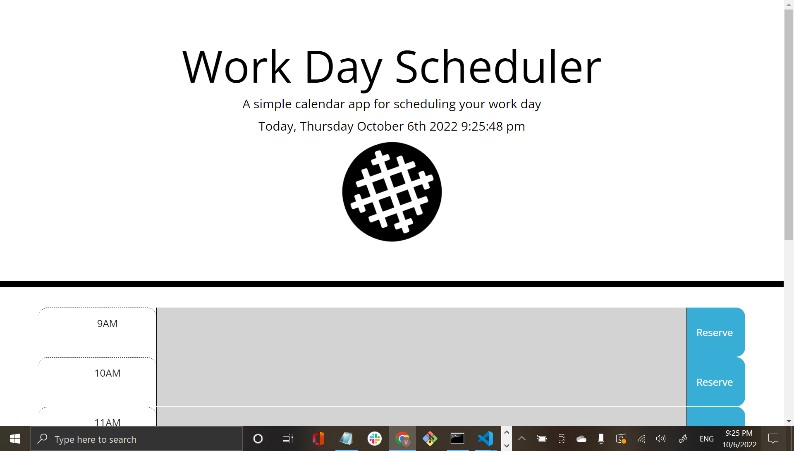

# Calendar Scheduler

## Deployable Link

https://elduderino23.github.io/apparao-vasu-calender/

## Goal
The task was to make a calendar planner that dynamically showed when a time slot was in the past, present or future with the colors grey red and green in their respective parts. Another part of the task was to display the current time on the front of the page.

## Technology Use
  - Javascript
  - HTML
  - CSS
  - Bootstrap
  - JQuery
  - Moment.js
  - VS Code
  - Git Bash 
  - GitHub

## Execution
The plan of attack was started with restructuring the html in order to have a basic set up. Luckily with the help of Bootstrap, it was generally easy to set up the bare bones structure necessary to accommodate elements crucial to sculpt with JQuery. After the necessary classes and ids were put in the right spot, the next phase, and more difficult part, of the planner was to style the html using JQuery.

The first task in making the calendar planner work was to show the time in real time. With the help of Moment.js, it was possible to create a function that dynamically shifted the time and date in real time. 

The function in order to make this happen is shown below:

```Javascript
var realTime = function () {
    var currentTime = moment().format('[Today], dddd MMMM Do YYYY h:mm:ss a')
    $("#currentDay").text(currentTime)
}
```
currentDay was the id in the HTML that controlled the date so adding a function that calculated the current time, in the form of a variable aptly named currentTime, display the time in real time. The interval down below set the time for every 1000 millisecond, one second,:

```Javascript
setInterval(realTime, 1000)
```

The second part, and the hardest part, of styling the javascript with JQuery was syncing the color code, red being present; green being future; grey being past, with the actual time. In order to accomplish this herculean task, the first step was to make a variable within the realTime function that corresponded the time with the colors. Rather than do a standard 12 hour cycle, the choice to do "military time", 24 hour cycle, as the basis for color control made it easier for the function to recognize what color for what time. 

The set up is shown below:

```Javascript
var currentHour = moment().format("HH")
```

The tricky part was to coordinate the time with the colors. In order to achieve this, an if, else if, and else statement had to be made within each if statement was the "currentHour > past" condition. This was so that function could recognize that it was before the time slot and assign the color grey for past. the else if had the condition of "currentHour == 9" the double equal signs signifies that the function want the value only. else was left behind because the other two laid the conditions already so the third was known. In between each statement was the correct syntax of JQuery of adding a class and removing a class. Since the past, present, and future class was hard codded into the HTML, it was necessary to remove certain classes for different parts of the time, example being remove past and future class in order to let red show for present.

the following if, else if, and else statement combo perfectly encapsulates the point:

```Javascript
if(currentHour > 9){
  $('#description-9').addClass('past').removeClass('present').removeClass('future')
}else if(currentHour == 9){
  $('#description-9').addClass('present').removeClass('past').removeClass('future')
}else{
  $('#description-9').addClass('future').removeClass('past').removeClass('present')
```
9-12 time slots were straight forward because those numbers don't change whether its military time or not. 1-5 time slots had to be changed into 13-17 hour time slots because the earlier equation uses 
 military time so it had to be incorporated.

 the following if, else if, else demonstrates the idea:

 ```Javascript
if(currentHour > 13){
  $('#description-1').addClass('past').removeClass('present').removeClass('future')
}else if(currentHour == 13){
  $('#description-1').addClass('present').removeClass('past').removeClass('future')
}else{
  $('#description-1').addClass('future').removeClass('past').removeClass('present')
}
if(currentHour > 14){
  $('#description-2').addClass('past').removeClass('present').removeClass('future')
}else if(currentHour == 14){
  $('#description-2').addClass('present').removeClass('past').removeClass('future')
}else{
  $('#description-2').addClass('future').removeClass('past').removeClass('present')
}
if(currentHour > 15){
  $('#description-3').addClass('past').removeClass('present').removeClass('future')
}else if(currentHour == 15){
  $('#description-3').addClass('present').removeClass('past').removeClass('future')
}else{
  $('#description-3').addClass('future').removeClass('past').removeClass('present')
}
if(currentHour > 16){
  $('#description-4').addClass('past').removeClass('present').removeClass('future')
}else if(currentHour == 16){
  $('#description-4').addClass('present').removeClass('past').removeClass('future')
}else{
  $('#description-4').addClass('future').removeClass('past').removeClass('present')
}
if(currentHour > 17){
  $('#description-5').addClass('past').removeClass('present').removeClass('future')
}else if(currentHour == 17){
  $('#description-5').addClass('present').removeClass('past').removeClass('future')
}else{
  $('#description-5').addClass('future').removeClass('past').removeClass('present')
}
 ```
The last part was the ability to type an event into a textfield, saving it, and having the typed field stay after refreshing the field. This boiled down to setting and getting items in localStorage and making a function dedicated to submitting.

The below code is the result:

```Javascript
$(".saveBtn").on("click", function(){
  var id = $(this).attr("id")
  console.log(id.split("-")[1])
  var text = $("#description-"+(id.split("-")[1])).val()
  console.log(text)
  localStorage.setItem(id,text)
})

$("#description-9").val(localStorage.getItem("reserve-9"));
$("#description-10").val(localStorage.getItem("reserve-10"));
$("#description-11").val(localStorage.getItem("reserve-11"));
$("#description-12").val(localStorage.getItem("reserve-12"));
$("#description-1").val(localStorage.getItem("reserve-1"));
$("#description-2").val(localStorage.getItem("reserve-2"));
$("#description-3").val(localStorage.getItem("reserve-3"));
$("#description-4").val(localStorage.getItem("reserve-4"));
$("#description-5").val(localStorage.getItem("reserve-5"));
```
## Result

The following website demonstrates what the final product looks like:


